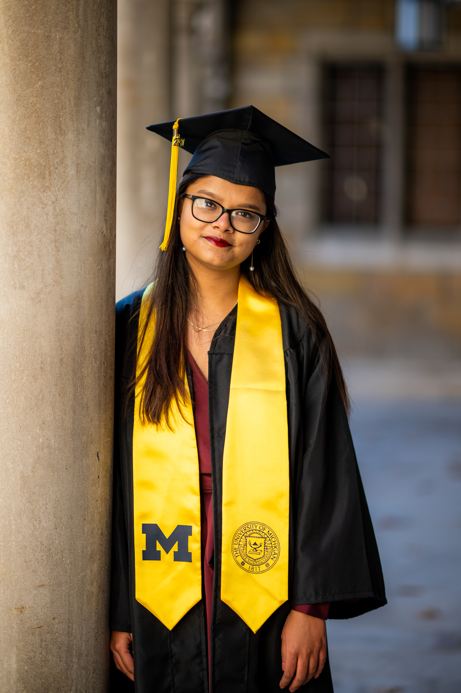

## Introduction

Hi, I am Farizah Rob! I am a 23 year old Bangladeshi, living in the United States since 2018. I am currently based in New York City where I am pursuing my graduate degree in Biostatistics. Previously, I was in Ann Arbor, Michigan where I completed my undergraduate studies, majoring in Statistics. My hobbies include watching TV and movies, trying out new foods and going to parks! 

{width=50%}

## Links:

[About Me: Education and Work Experience](about.html)

[Problem 3](dashboard.html)

[Github](https://github.com/fir2103)

[Email](fir2103@cumc.columbia.edu)

